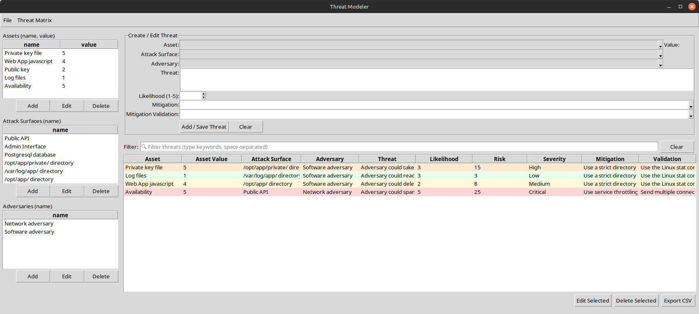
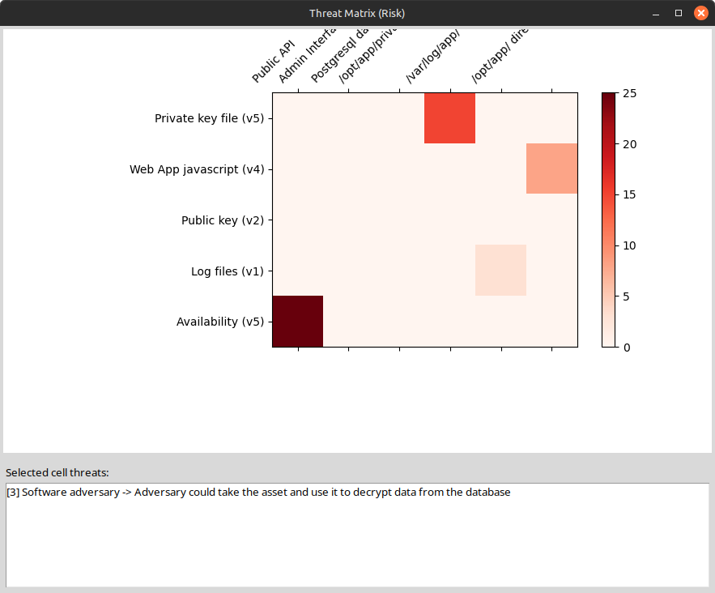

# Python threat modeler tool
### A simple threat modelling tool written in Python

To run, execute `python3 threat_modeler.py`

Add assets, attack surfaces and adversaries first.  Then use the central top section to assemble threats one by one.

A threat matrix is also available from the menu once threats have been added.

You can export the threat model as a JSON file or it can also be exported as a CSV file.

## To follow
- Changing 1 - 5 values for assets and likelihood to words such as "very unlikely", "very likely", "low value" etc. and displaying them instead of the numeric values.

